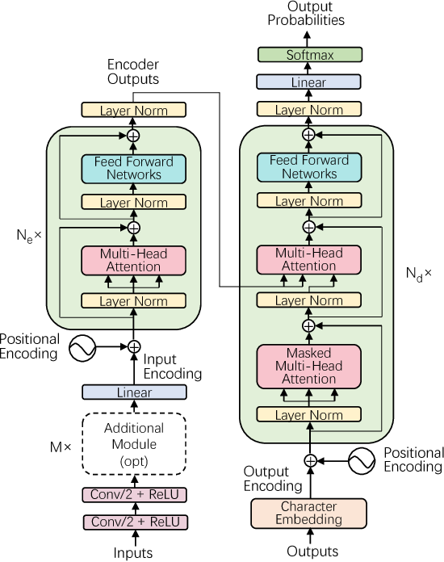

# Speech-Transformer Model
## I. Architecture

## II. Setup Environment
1. Make sure you have installed Python.
2. Python version `3.10.9`
3. cd `{project_folder}`
4. Install needed packages: `pip install requirements.txt`

### III. Parameters
1. `vocab_size`: Number of tokens in Tokenizer.
2. `sample_rate`: Number of samples get in 1 second of audio data.
3. `duration`: Max time of audio data.
4. `frame_size`: Length of the windowed signal after padding with zeros
5. `hop_length`: Number of audio samples between adjacent STFT columns.
6. `length_seq`: Max token in a sequence.
7. `n_e`: Number of Encoder layers.
8. `n_d`: Number of Decoder layers.
9. `embedding_dim`: Dimension of Word2Vec.
10. `heads`: Number of heads in Multi-head Attention.
11. `d_ff`: Hidden neutrons in Position Wise Feed-Forward Networks.
12. `dropout_rate`: Probability of an element to be zeroed.
13. `eps`: A value added to the denominator for numerical stability.
14. `activation`: Activation function in hidden layer.
15. `m`: Number of 2-D Attention Layers.
16. `channels`: Number of hidden channels in 2-D attention.